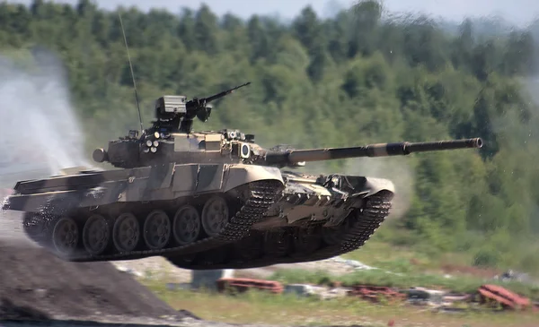
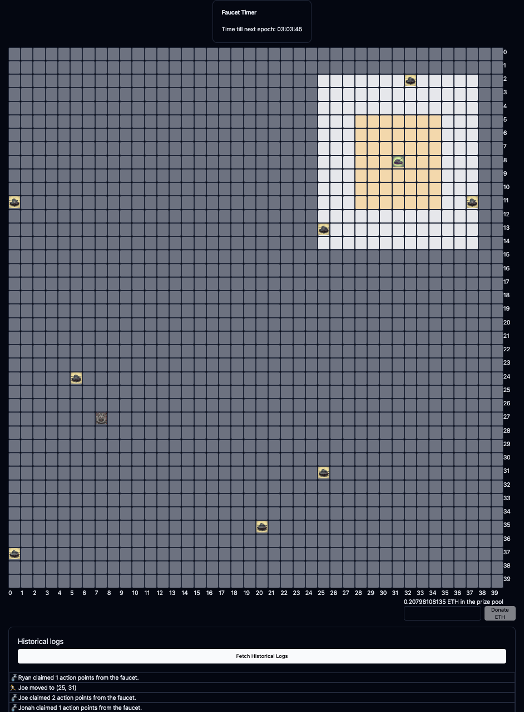

[licence-badge]: https://img.shields.io/github/license/rsproule/tanks?color=blue
[licence-url]: https://github.com/rsproule/tanks/blob/main/LICENSE
[actions-badge]: https://github.com/rsproule/tanks/actions/workflows/test.yml/badge.svg
[actions-url]: https://github.com/rsproule/tanks/actions/workflows/test.yml
[twitter-badge]: https://img.shields.io/twitter/follow/sproule_
[twitter-url]: https://twitter.com/sproule_

# Tank Trust Tactics

[![MIT licensed][licence-badge]][licence-url]
[![Build Status][actions-badge]][actions-url]
[![Twitter][twitter-badge]][twitter-url]

> A game of trust in an environment of no trust.  Bring your own trust: BYOT.

 

## Rules

- initialize: all players are randomly placed on the board with 3 lives and 0 APs.
- every _epoch_ (24 hours) every player is given an AP.
- APs can be spent whenever you like in the following ways:
  - Move to an adjacent square (1 AP)
  - Shoot a tank within range (1 AP). Removes 1 heart.
  - Buy a heart (1 AP)
  - Upgrade your range (3 APs)
- Tanks can shoot or trade with any other tanks that are in range
- Initially, all tanks have range of 2.
- Player are dead whenever they are shot with 0 hearts.
- The player who lays the killing blow is takes all the APs
- players can send hearts or APs as gifts to anyone in range
- Dead players can be revived by someone who sends them a heart (they will have 1 heart and 0 AP)
  - not sure how range impacts this (do they have to be in range of their death? probably)
- once a day a heart spawns randomly on the field, whoever goes to that square earns a heart

### Jury rules

- dead players form a jury
- once per epoch, the jury decides which player to "curse" which prevents them from earning an AP that day

### Notes on on-chain issues

- sophisticated actors can put in all their actions before humans have time to react
  - either allow this to become a mev game
  - or put a timer in where there is only one global action allowed per 5 mins or something
- action points are supposed to be secret
  - on-chain privacy stuff, could do a tornado style pool

---

## The frontend (v1)

---

## Motivation

The primary game mechanic is trust and deceit. This is an experiment to see how the infrastructure of trustless blockchains can help players coordinate in ways that are not possible in the real world.
